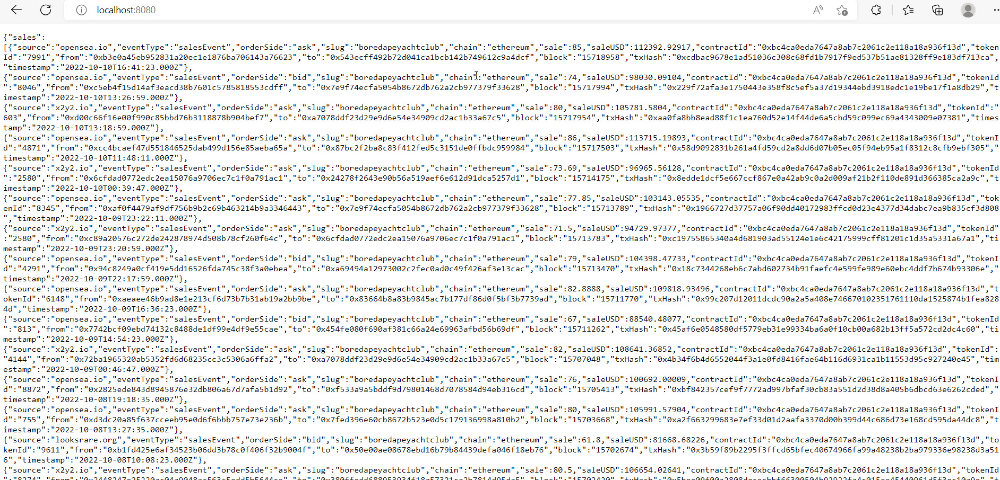
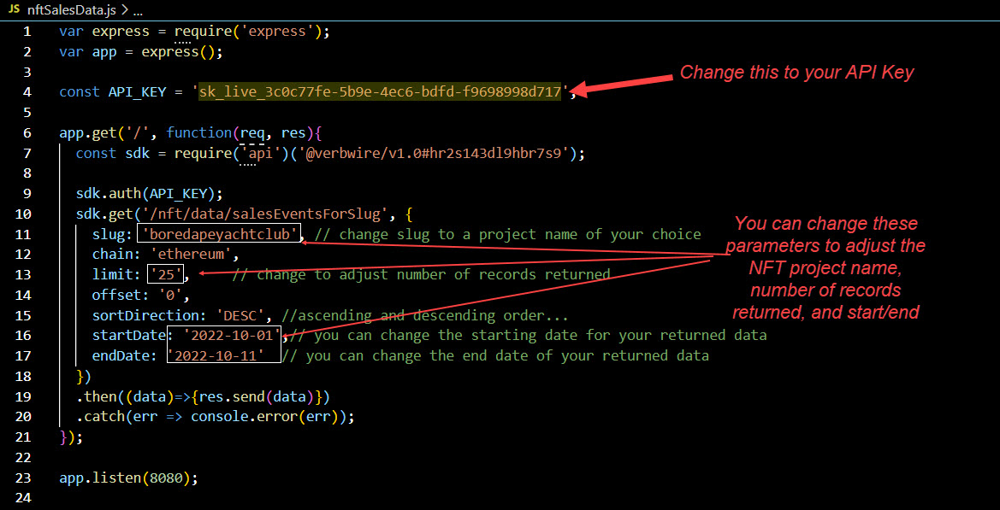

    

# NFT Sales Data Sample App
This simple app was built using the Verbwire API. The App displays NFT sales data for a given nftName and over a specified time period. For more details on using the Verbwire API you can access the full API docs [here](https://docs.verbwire.com/docs)

## Requirements
1. Make sure you have a Verbwire API Key. You can sign up for a free API key [HERE](https://www.verbwire.com/auth/register)

## Steps to run program locally
1. Replace the API Key in the file, nftSalesData.js, with your actual API key. See image in the additional section below.

2. From you command prompt, type in *npm i* to install node modules

3. From you command prompt, type in *node nftSalesData.js* to start the program 

4. Open your browser and goto localhost:8080 to see the program running

Your output should look like this:

    

## Additional Info
### 1. Showing where to input your API Key, as well as changing parameters

    

